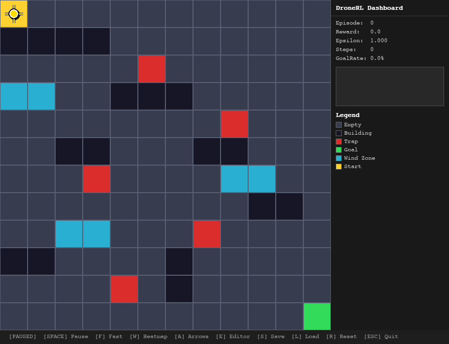
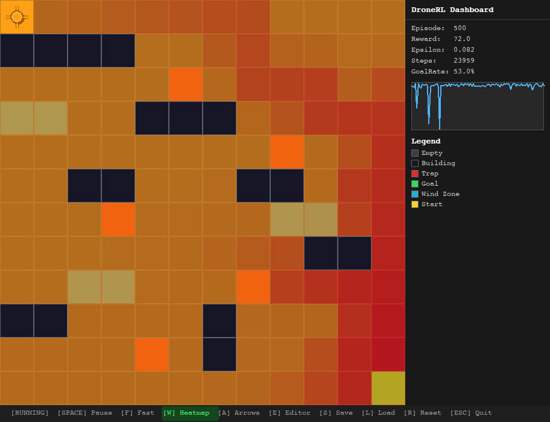
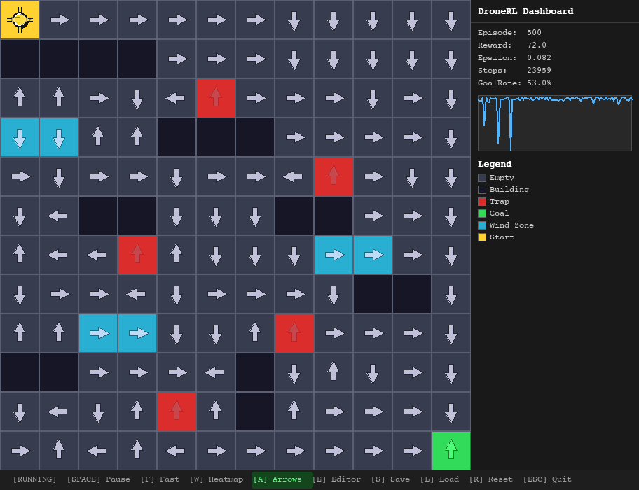

# DroneRL — Smart City Drone Delivery

An educational Reinforcement Learning game built with Python and Pygame.
Watch a drone learn to deliver packages across a smart city grid using Tabular Q-Learning.

## Screenshots

| Initial state (paused) | Heatmap overlay (ep 500) | Policy arrows overlay |
|---|---|---|
|  |  |  |

## What You'll Learn

- **Q-Learning & Bellman Equation** — how values propagate backwards through a grid
- **Epsilon-Greedy Exploration** — the explore/exploit tradeoff
- **Reward Shaping** — how penalties and incentives guide learning
- **Value Heatmaps** — visual representation of learned Q-values

---

## Installation

**Requires Python 3.11+ and Git**

### 1) Install `uv` (if not already installed)

#### Windows (PowerShell)
```powershell
powershell -ExecutionPolicy ByPass -c "irm https://astral.sh/uv/install.ps1 | iex"
```

#### macOS / Linux
```bash
curl -LsSf https://astral.sh/uv/install.sh | sh
```

After install, restart your terminal (or open a new one) so `uv` is available in `PATH`.

### 2) Clone project and install dependencies

```bash
git clone https://github.com/hodayakashh/dronerl.git
cd dronerl
uv sync
```

### 3) Run the app

```bash
uv run dronerl
```

---

## Usage

Run all commands below from the repository root (`dronerl/`).

### Visual Training (GUI)
```bash
uv run dronerl
```

### Headless Training (fast, no GUI)
```bash
uv run dronerl --headless --episodes 3000
```

### Level Editor
```bash
uv run dronerl --edit
```

### Custom Setup Config
```bash
uv run dronerl --config config/setup.json --episodes 5000
```

---

## Configuration

Edit `config/settings.yaml` to tune the agent:

| Parameter | Default | Description |
|---|---|---|
| `agent.alpha` | `0.1` | Learning rate |
| `agent.gamma` | `0.95` | Discount factor |
| `agent.epsilon_start` | `1.0` | Initial exploration rate |
| `agent.epsilon_min` | `0.01` | Minimum exploration rate |
| `agent.epsilon_decay` | `0.995` | Epsilon decay per episode |
| `agent.max_episodes` | `3000` | Training episodes |
| `agent.max_steps` | `200` | Max steps per episode |

Edit `config/setup.json` for GUI and grid settings.

---

## GUI Controls

| Key | Action |
|---|---|
| `W` | Toggle value heatmap |
| `A` | Toggle policy arrows |
| `Space` | Pause / Resume |
| `ESC` | Quit |

### Level Editor Controls (`uv run dronerl --edit` or press `E` in GUI)

- Left click: paint selected brush
- Left-click drag: continuous paint
- Right click: erase to empty
- `1..6`: select brush (`Empty`, `Wall`, `Trap`, `Wind`, `Goal`, `Start`)
- `Tab` / mouse wheel: cycle brush
- `S`: save to `config/custom_level.yaml`
- `R`: reset grid
- `ESC`: exit editor

---

## Troubleshooting

| Problem | Solution |
|---|---|
| `uv: command not found` | Run `curl -LsSf https://astral.sh/uv/install.sh \| sh` then restart terminal |
| `pygame.error: No video mode has been set` | Set `SDL_VIDEODRIVER=dummy` for headless environments |
| `No module named dronerl` | Run `uv sync` to install the package |
| Game window doesn't open | Make sure you're running `uv run dronerl` (not `python main.py`) |
| `Brain loaded!` not appearing after `L` | Press `S` first to save a brain, then `L` to load it |
| Fast mode still feels slow | Press `F` to toggle — status bar should turn green |
| Config version warning at startup | Update `config/setup.json` `"version"` field to `"1.00"` |

---

## Running Tests

```bash
uv run pytest tests/ --cov=src --cov-report=term-missing
```

## Linting

```bash
uv run ruff check src/
```

---

## Project Structure

```
dronerl/
├── src/dronerl/        # Source package
│   ├── environment/    # Grid, Wind, Rewards, Env
│   ├── agent/          # QTable, Policy, Agent
│   ├── gui/            # Renderer, Heatmap, Arrows, Dashboard
│   ├── shared/         # Config, Logger, Version
│   └── sdk.py          # Public API
├── tests/              # Unit & integration tests
├── config/             # YAML/JSON configuration
├── docs/               # PRD, PLAN, TODO, Algorithm PRDs
├── results/            # Experiment outputs
└── pyproject.toml      # Build & tooling config
```

---

## Key Concepts

### Q-Learning (Bellman Equation)
```
Q(s,a) ← Q(s,a) + α · [r + γ · max Q(s',a') − Q(s,a)]
```

### Epsilon-Greedy
- With probability `ε`: explore (random action)
- With probability `1-ε`: exploit (best known action)
- `ε` decays from 1.0 → 0.01 over training

### Environment Rewards
| Event | Reward |
|---|---|
| Step (time penalty) | −1 |
| Reach goal | +100 |
| Hit trap | −50 |
| Wind deflection | −2 |
| Wall collision | −5 |

---

## Architecture

See [`docs/ARCHITECTURE.md`](docs/ARCHITECTURE.md) for the full system diagram.

**Layer summary:**
```
CLI / GUI  →  DroneRLSDK  →  Environment (Grid, Wind, Rewards)
                         →  Agent       (QTable, Policy)
                         →  Shared      (Config, Logger)
```

---

## Extension Points

| What to extend | Where | How |
|---|---|---|
| New cell types | `environment/grid.py` | Add to `CellType` enum |
| Custom reward function | `environment/rewards.py` | Subclass `RewardCalculator` |
| Different RL algorithm | `agent/agent.py` | Replace Bellman update logic |
| New exploration policy | `agent/policy.py` | Implement `select()` + `decay_epsilon()` |
| Custom grid layout | `config/settings.yaml` | Edit `layout` section |
| New overlay | `gui/` | Implement `draw(surface, q_table, grid)` |

---

## Deployment

### Local (development)

```bash
uv sync
uv run dronerl
```

### Headless server / CI

```bash
uv sync --no-dev
uv run dronerl --headless --episodes 3000
```

Set `SDL_VIDEODRIVER=dummy SDL_AUDIODRIVER=dummy` if no display is available (already done automatically in headless mode).


---

## Quality (ISO/IEC 25010)

| Characteristic | How it is addressed |
|---|---|
| **Functional suitability** | Q-Learning agent reliably converges; 190 unit/integration tests |
| **Performance efficiency** | 14 000+ training episodes/sec; float32 Q-table |
| **Compatibility** | Pure Python 3.13, cross-platform (macOS/Linux/Windows) |
| **Usability** | Interactive GUI with heatmap, policy arrows, live dashboard |
| **Reliability** | 96 % test coverage; frozen config dataclasses prevent mutation |
| **Security** | All external calls routed through `ApiGatekeeper` (rate-limiting) |
| **Maintainability** | ≤150-line files; Ruff zero-error; SDK facade; dependency injection |
| **Portability** | `uv` lockfile ensures reproducible installs; Docker-ready |

---

## Contributing

### Code conventions

| Rule | Tool |
|---|---|
| Linting | `uv run ruff check src/` |
| Formatting | `uv run ruff format src/` |
| Tests | `uv run pytest tests/` |
| Package manager | `uv` only — no `pip` |

---

## Author

DroneRL — BIU Deep Reinforcement Learning Course
